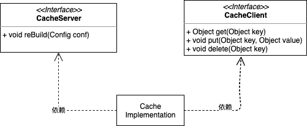

# geektime_arch_training_camp
极客时间架构师训练营第02周作业

# 作业一：
# 1、请描述什么是依赖倒置原则，为什么有时候依赖倒置原则又被称为好莱坞原则？
依赖倒置原则（Dependency Inversion Principle）：
A.高层次的模块不应该依赖于低层次的模块，他们都应该依赖于抽象。
B.抽象不应该依赖于具体实现，具体实现应该依赖于抽象。
依赖倒置原则更像是一种你应该养成的编程习惯，它要求你面对接口编程。
例子：类A,类B，类C,都有相同的属性，相同的方法，然后都有可能被类H调用（高层调用低层），这样H类的实例如果调用这三个类，那么这个类H就和这三个类就发生了耦合，但是如果把这三个类抽取出一个接口I，类H调用I（面向接口编程），H就依赖于接口，A、B、C也依赖于接口。好处是，在这种情况下，类与类之间的耦合降低了，不依赖具体类而是依赖于接口。

好莱坞原则（Hollywood Principle） Dont's call me, I'll call you.
别打电话给我们，有事我会打电话给你。
好莱坞原则是用在系统的高层组件与底层组件之间。高层组件不应该直接调用底层组件，而是从容器获取。
例子：假设qq在线聊天，有聊天框和表情选择框，那么，打开聊天框，然后打开表情框，选择表情——这个过程不应该在聊天框的代码里出现（或者说，聊天框不应该参与直接调用表情框），而是应该聊天框告诉qq容器：我要调用A，虽然我不知道那是什么，然后容器提供A（表情框组件）。好处是，假如之后腾讯更新了更好的表情框，然后由容器控制生命周期，而聊天框则不参与。

# 2、 如下图

# 作业二：学习总结
通过本周课程的学习，更加深刻的理解了开闭原则、依赖倒置原则、里氏替换原则、单一职责原则、接口隔离原则等等的重要性。回想起以前在学校内学习过以上的各种原则，当时由于没有过太多的项目经验，所以对这些原则没有太大的感悟。现在已经工作了好几年，积累了比较多的项目经验后，再回过头来系统学习这些原则，有种恍然大悟的感觉，印象深刻，也会逐步在实际工作项目中引入对应的软件设计原则，提高代码可维护、可复用、可扩展性。
